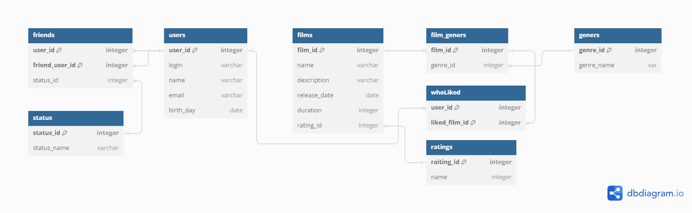

# java-filmorate
Template repository for Filmorate project.

 (dateBase)

Таблица user хранит всех пользователей с основной информацией о них.

Таблица friends устанавливает соответствие между пользователями,
которые добавили друг друга в друзья,
также хранит статус заявки в друзья.

Таблица status хранит сами статусы заявок в друзья. Вынесено, в отельную таблицу
на случай, если статусов в будущем окажется больше.

Таблица film хранит все фильмы с основной информацией о них.

Таблица film_genre устанавливает соответствие между id фильма 
и id жанра.

Таблица genre хранит отдельные жанры. Вынесено в отдельную таблицу
на случай увеличения количества жанров или их изменения.

Таблица whoLiked хранит каждый лайк, каждого пользователя.

Популярные фильмы или количество друзей можно вывести SQL запросом,
посчитав сумму и сгруппировав по id_film / id_user