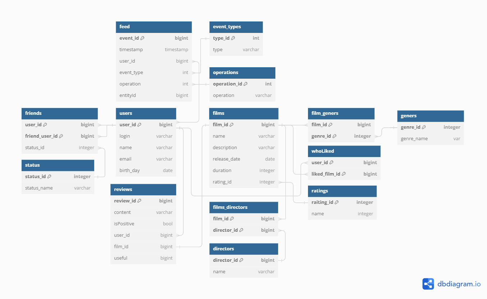

# Java filmorate

## Описание
Backend часть приложения для работы с фильмами и их рейтингами.

## Технологии и инструменты
* Java core
* Spring Boot
* JDBC + SQL - подключение к базе данных, запросы
* Maven - управление зависимостями, многомодульность
* Docker - развертывание и контейнеризация
* Junit 5 - тестирование
* СУБД - H2
* Lombok

## Цель
Освоение Java, SpringBoot, Sql, H2, Maven

## Функционал
API приложения обеспечивает CRUD операции с пользователями, поддерживая функционал добавления
и взаимодействия с друзьями, включая вывод ленты, на основе действий пользователя, также алгоритм рекомендаций.
Добавлена возможность оценивать фильмы и отзывы.

В проекте реализован функционал добавления отзывов, работы с жанрами и режиссерами. Возможен гибкий поиск фильмов.

## Запуск
1. Клонировать репозиторий git clone https://github.com/SergeyIv24/java-filmorate.git
2. cd java-filmorate

## ER - diagram
Главный сервер:

## Тестирование API с помощью Postman коллекции
[Коллекция для тестирования приложения]()